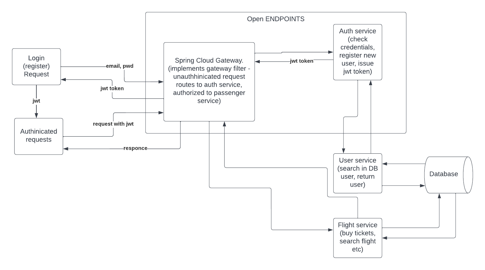

# AIRPORT

This is my pet project with microservices on JAVA with Spring.
This project contains next services
## Services 
- auth-service
- cloud-gateway
- eureka-server
- flight-service
- user-service

  

Each service has it own responsibilities. Let`s start.
- auth-service
This service provide authentication, so it`s have two open endpoints: auth/register and auth/login. 
When someone tried to log in with existing user, this service send request to user service ("email" which is login and password) using Netflix Feign. User-service connects to MySQL database and search for this record. If exist check credentials and issue JWT token.
- cloud-service: it`s just a Spring Cloud Gateway with custom implemented filters. So credentials are ok user can access flight-service endpoints.
- flight-service: there few demonstrate controllers: Flight, Ticket and Passenger.   
Flight controller returns flights by selected period or all available flights/
Passenger controller (each user can have multiple passengers) have endpoints to access all passengers and their tickets.
Ticket controller  have endpoints to get all free tickets by flight, and buy ticket on flight.
- eureka-server Netflix Eureka
- user-service get user information from database.

Also docker-compose file to get all containers dockerized.